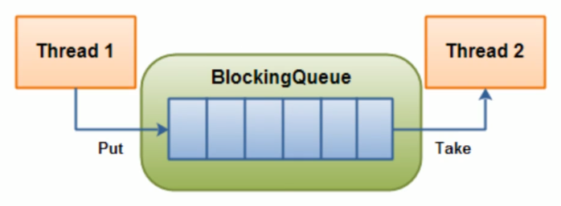
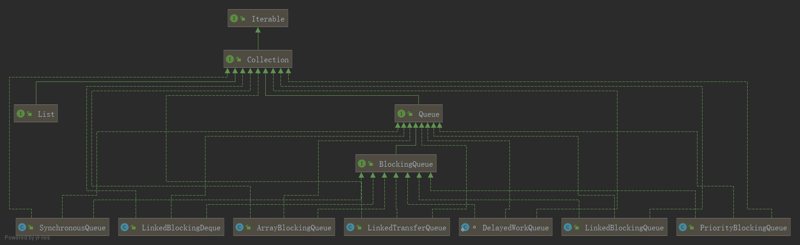

## 阻塞队列知道吗？
- 阻塞队列，顾名思义，首先它是一个队列，而一个阻塞队列在数据结构中索契的作用大致如下图所示：
  
- 当阻塞队列是空时，从队列中获取元素的操作将会被阻塞。  当阻塞队列是满时，往队列里添加元素的操作将会被阻塞。
- 试图从空的阻塞队列中获取元素的线程将会被阻塞，知道其他的线程往空的队列插入新的元素。同样，试图往已满的阻塞队列中添加新元素的线程同样也会被阻塞，直到其他的线程
从列中移除一个或者多个元素或者完全清空队列后使队列重新变得空闲起来并后续新增。

#### 为什么用，有什么好处？
- 在多线程领域：所谓阻塞，在某些情况下会挂起线程(即阻塞)，一旦条件满足，被挂起的线程又会自动被唤醒
- 好处是我们不需要关心什么时候需要阻塞线程，什么时候需要唤醒线程，因为这一切BlockingQueue都一手包办了；在 concurrent 包发布以前，在多线程环境下，我们每个程序员都必须去自己控制这些细节，尤其还要兼顾效率和线程安全，会给我们程序带来不小的复杂度  

#### 架构梳理与种类分析  

  - 种类分析
    - ArrayBlockingQueue：由数组结构组成的有界阻塞队列。
    - LinkedBlockingQueue：由链表结构组成的有界(大小默认为Integer.MAX_VALUE)阻塞队列。
    - PriorityBlockingQueue：支持优先级排序的无界阻塞队列。
    - DelayBlockingQueue：使用优先级队列实现的延迟无界阻塞队列。
    - SynchronousQueue：不存储元素的阻塞队列，也即单个元素的队列。
    - LinkedTransferQueue：由链表结构组成的无界阻塞队列。
    - LinkedBlockingDeque：由链表结构组成的双向阻塞队列。
 - BlockingQueue的核心方法  
|id|name|
|:-|:-|
|1|A1|
|2|A2|
|3|A3|
