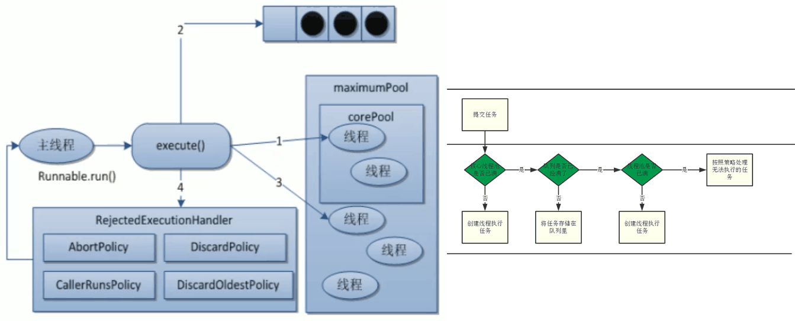

## 线程池用过吗？
#### 线程池优势
- 线程池做的工作主要是控制运行的线程的数量，处理过程中将任务放入队列，然后在线程创建后启动这些任务，如果线程数量超过了最大数量超出数量的线程排队等候，等其他线程执行完毕，再从队列中取出任务来执行。  
- 主要特点：线程复用、控制最大并发数、线程管理。  
    - 降低资源消耗。通过重复利用已创建的线程降低线程创建和销毁造成的消耗。
    - 提高响应速度。当任务到达时，任务可以不需要的等到线程创建就能立即执行。
    - 提供线程的可管理性。线程是稀缺资源，如果无限制的创建，不仅会消耗系统资源，还会降低系统的稳定性，使用线程池可以进行统一的分配，调优和监控。
#### 如何使用
- 架构说明  
&#8194;&#8194;&#8194;&#8194;Java中的线程池是通过Executor框架实现的，该框架中用到了 Executor，Executors，ExecutorService，ThreadPoolExecutor这几个类。
  
- 线程池3个常用方式
```java
/**
 * 了解：
 * Executors.newScheduledThreadPool()
 * java8新出：Executors.newWorkStealingPool(int)-使用目前机器上可用的处理器作为它的并行级别
 *
 * @author chenxiaonuo
 * @date 2019-08-16 16:34
 */
public class ThreadPoolDemo {

    public static void main(String[] args) {
        //ExecutorService executorService = Executors.newFixedThreadPool(5);//固定5个线程的池子
        //ExecutorService executorService = Executors.newSingleThreadExecutor();//一个线程的池子
        ExecutorService executorService = Executors.newCachedThreadPool();//N个线程的池子

        //模拟10个用户来办理业务
        try {
            for (int i = 0; i < 20; i++) {
                executorService.execute(()->{
                    System.out.println(Thread.currentThread().getName() + "  办理业务！");
                });
            }
        } catch (Exception e){
            e.printStackTrace();
        } finally {
            executorService.shutdown();
        }
    }
}

```

 ```java
public class Executors{
    
    /*
        1.创建一个定长线程池，可控制线程最大并发数，超出的线程会在队列中等待
        2.创建的线程池corePoolSize和maximumPoolSize值是相等的，它使用的LinkedBlockingQueue
        3.执行长期的任务，性能好很多
    */
    public static ExecutorService newFixedThreadPool(int nThreads) {
            return new ThreadPoolExecutor(nThreads, nThreads,
                                          0L, TimeUnit.MILLISECONDS,
                                          new LinkedBlockingQueue<Runnable>());
    }
    
    /*
        1.创建一个单线程化的线程池，它只会用唯一的工作线程来执行任务，保证所有任务按照指定顺讯执行。
        2.将corePoolSize和maximumPoolSize都设置为1，它使用的它使用的LinkedBlockingQueue
        3.一个任务一个任务执行的场景
     */
    public static ExecutorService newSingleThreadExecutor() {
            return new FinalizableDelegatedExecutorService
                (new ThreadPoolExecutor(1, 1,
                                        0L, TimeUnit.MILLISECONDS,
                                        new LinkedBlockingQueue<Runnable>()));
    }
    
    /*
        1.创建一个可缓存线程池，如果线程池长度超过处理需要，可灵活回收空闲线程，若无可回收，则新建线程
        2.将corePoolSize设置为0，将maximumPoolSize设置为Integer.MAX_VALUE，使用的SynchronousQueue，也就是说
            来了任务就创建线程运行，当线程空闲超过60秒，就销毁线程
        3.执行很多短期异步的小程序或者负载较轻的服务器
     */
    public static ExecutorService newCachedThreadPool() {
            return new ThreadPoolExecutor(0, Integer.MAX_VALUE,
                                          60L, TimeUnit.SECONDS,
                                          new SynchronousQueue<Runnable>());
    }
    
}
```
#### 线程池的几个重要参数介绍
```java
 public ThreadPoolExecutor(int corePoolSize,
                              int maximumPoolSize,
                              long keepAliveTime,
                              TimeUnit unit,
                              BlockingQueue<Runnable> workQueue,
                              ThreadFactory threadFactory,
                              RejectedExecutionHandler handler)
```
|参数|描述|备注|
:-:|:-|:-
|corePoolSize|线程池中的常驻核心线程数|1.在创建了线程池后，当有任务来之后，就会安排池中的线程去执行请求任务；2.当线程池中的线程数量达到corePoolSize后，就会把到达的任务放到缓存队列当中|
|maximumPoolSize|线程池能够容纳同时执行的最大线程数，此值必须大于等于1||
|keepAliveTime|多余的空闲线程的存活时间|当前线程池的数量超过corePoolSize时，当空闲时间达到keepAliveTime时，多余空闲线程会被销毁只到只剩下corePoolSize个线程为止。|
|unit|keepAliveTime的单位||
|workQueue|任务队列，被提交但尚未被执行的任务||
|threadFactory|表示生成线程池中工作线程的线程工厂，用于创建线程一般用默认的即可||
|handler|拒绝策略，表示当队列满了并且工作线程大于等于线程池的最大线程数maximumPoolSize时如何来拒绝请求执行的 runnable 的策略||
#### 底层工作原理
  
1. 在创建了线程池后，等待提交过来的任务请求。
2. 当调用execute()方法添加一个请求任务时，线程池会做以下判断：  
    2.1 如果正在运行的线程数量小于 corePoolSize，那么马上创建线程运行这个任务。  
    2.2 如果正在运行的线程数量大于或等于 corePoolSize，那么将这个任务**加入队列**。  
    2.3 如果这时候队列满了且正在运行的线程数量还小于 maximumPoolSize，那么还是要创建非核心线程立即运行这个任务。  
    2.4 如果队列满了且正在运行的线程数量大于或等于 maximumPoolSize，那么线程池会启动饱和拒绝策略来执行。  
3. 当一个线程完成任务时，它会从队列中取下一个任务来执行。
4. 当一个线程无事可做超过一定时间(keepAliveTime)时，线程池会判断：
    - 如果当前运行的线程数大于corePoolSize，那么这个线程就会被停掉；
    - 所有线程池的所有任务完成后它最终会收缩到 corePoolSize 的大小。
    
#### 线程池的拒绝策略
&#8194;&#8194;&#8194;&#8194;等待队列已经满了，再也放不下新任务了；同时，线程池中的max线程也达到了，无法继续为新任务服务。这时候就需要拒绝策略机制合理的处理这个问题。
- JDK内置拒绝策略(均实现了RejectedExecutionHandler接口)
    - AbortPolicy(默认)：直接抛出 RejectedExecutionException 异常举止系统正常运行。
    - CallerRunsPolicy："调用者运行"一种调节机制，该策略既不会抛弃任务，也不会抛出异常，而是将某些任务回退到调用者，从而降低新任务的流量。
    - DiscardOldestPolicy：抛弃队列中等待最久的任务，然后把当前任务加入队列队列中尝试再次提交当前任务。
    - DiscardPolicy：直接丢弃任务，不予任何处理也不抛出异常。如何允许任务丢失，这是最好的一种方案。
    
#### 生产上如何设置合理参数
- CPU密集型  
    - 该类任务需要大量的计算，而没有阻塞，CPU一直全速运行。CPU密集任务只有在真正的多核CPU上才可能得到加速(通过多线程)。
    - 一般公式：**CPU核数+1**个线程的线程池
- IO密集型
    - 该类任务线程并不是一直在执行任务，则应配置尽可能多的线程，如**CPU核数\*2**
    - 该类任务需要大量的IO，即大量的阻塞。在单线程上运行IO密集型的任务会导致浪费大量的CPU运算能力浪费在等待。所以在IO密集型任务中使用多线程可以大大的加速程序运行，即使在单核CPU上，这种加速主要就是利用了被浪费掉的阻塞时间。
    - IO密集型时，大部分线程都被阻塞，故需要多配置线程数，参考公式：**CPU核数/(1-阻塞系数)**，阻塞系数在0.8~0.9之间，比如8核CPU：8/(1-0.9) = 80个线程数。
    
